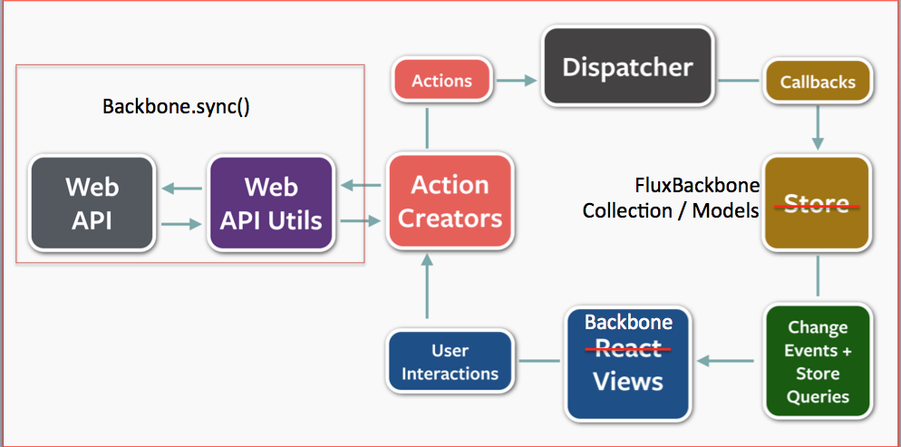

#Backbone TODO app using FluxBackbone

This is a rewrite of [Backbone TODO app](https://github.com/jashkenas/backbone/tree/master/examples/todos) to use Flux pattern using [FluxBackbone](https://github.com/vidoss/flux-backbone). It also uses Backbone.Sync() for the WebApi layer. 

